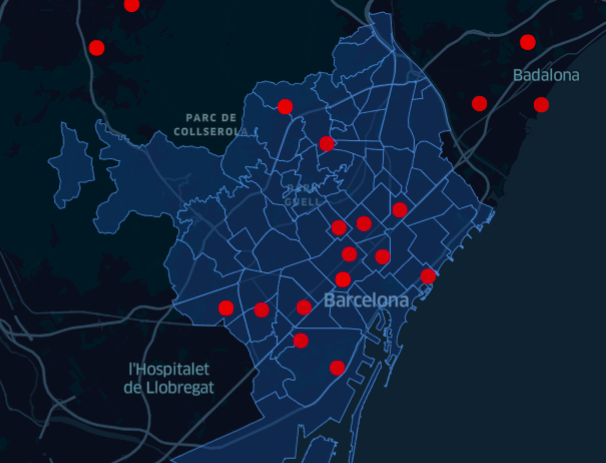
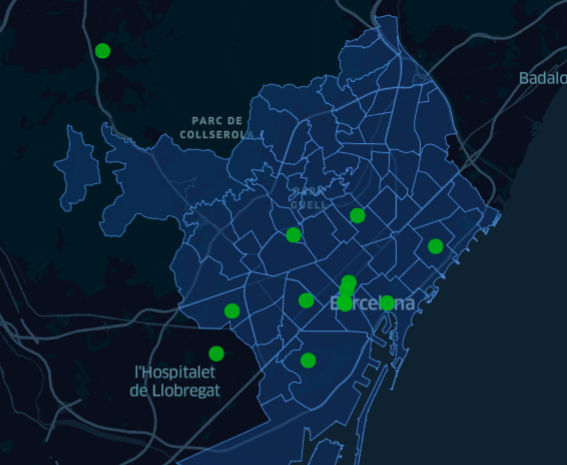

### WHAT IF you could know...
#### *What is the mood of your city today?*

An NLP project that analyzes the sentiment on the comments from Tweeter from people in Barcelona about the coronavirus topic.
* **Num of samples:** about 400 samples
* **Filter keywords:** "coronavirus, covid, mask, mascarilla, mascareta, covid-19"

* Negative comments re located in:

* Positive comments are located in:

*NOTE: Tweet data collected from 24th to 29th November 2020.*

### NEXT STEPS:
* Are the people living in the most expensive districts happier?
* Are the people living in Barcelona dowtown feeling negative today?
* Optimize CAT model for sentiment analisys.