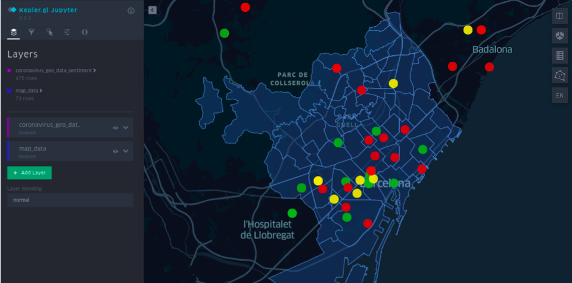
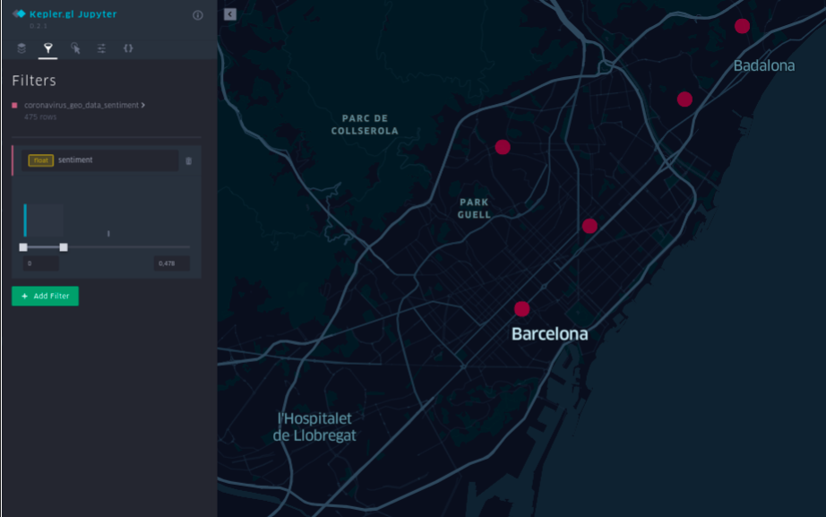
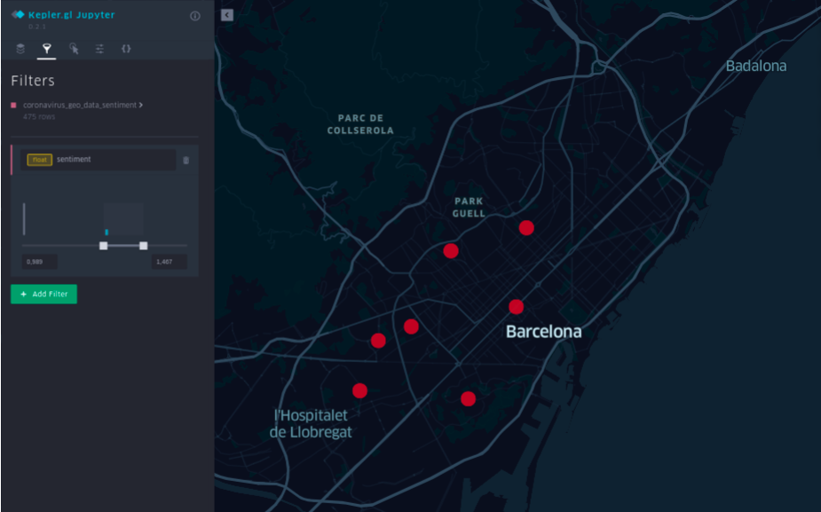

### WHAT IF you could know...
#### *What is the mood of your city today?*

An NLP project that analyzes the sentiment on the comments from people in Barcelona (about 400 comments).

Tweet data collected from 24th to 29th November 2020.

NEXT STEPS:
* Are the people living in the most expensive districts happier?
* Are the people living in Barcelona dowtown feeling negative today?